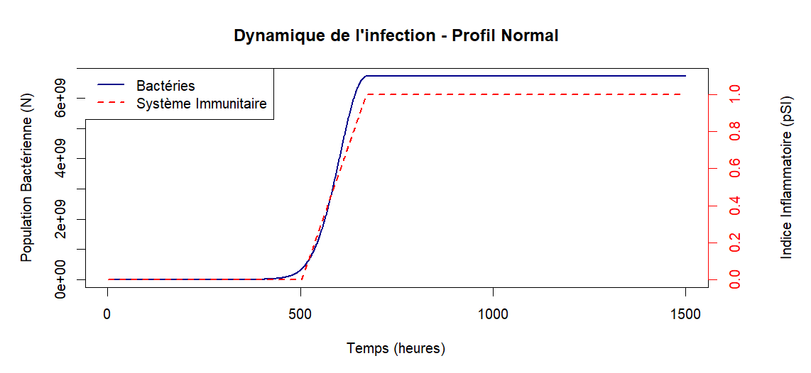

# modelisation-infection-tuberculose-R
Ce projet a pour objectif de lettre en pratique mes compétences acquises sur l'environnement apprises en autodidacte, ainsi que mes compétences de recherches et mes connaissances de cours.
La modélisation se fait sur 3 populations:

- la population normale: équilibré, représentant la plupart des personnes.
- la population vaccinée: système immunitaire entraîné.
- la population fragile: atteint d'immunodéficience

👉**[le projet complet est disponible ici](https://matteosoles.github.io/modelisation-infection-tuberculose-R/)

 
Pour modéliser cette interaction, des graphiques sont créés grâce à R:  

exemple: 

Les outils utilisés dans le cadre de ce projet sont:

- langage R (Rstudio)
- Rmarkdown
- Bibliothèque: ggplot2
- GitHub Pages
